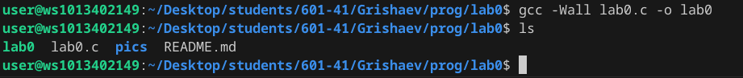
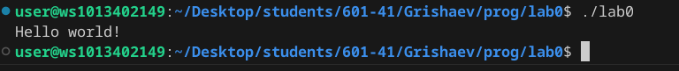
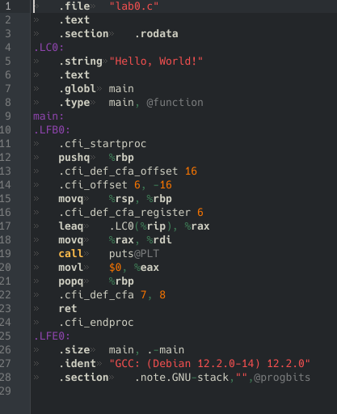

# Отчёт 

1. Создайте репозиторий для дисциплины на GitHub.
2. Склонируйте его себе на ПК.
3. Напишите свою первую программу.
4. Скомпилируйте и запустите её.
5. Получите по отдельности результаты каждого этапа компиляции.
6. Напишите отчёт в README.md. Отчёт должен содержать:
    + Задание
    + Описание проделанной работы
    + Консольные команды
    + Скриншоты результатов
    + Ссылки на используемые материалы

7. Сделайте коммит и пуш.
8. Добавьте для себя в отчёт шпаргалку по работе с git.

## Исходный код программы:
```c
#include <stdio.h>

int main()
{
    printf("Hello world!\n");
    return 0;
}
```

## Этапы сборки программы

### Сборка программы с помощью компилятора gcc:


### Результат запуска программы lab0:


### Получение объектного файла lab0.o:


### Получение ассемблерного кода:



### Результат обработки исходного кода препроцессором:


