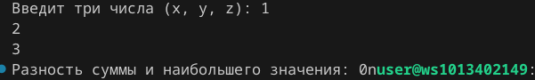
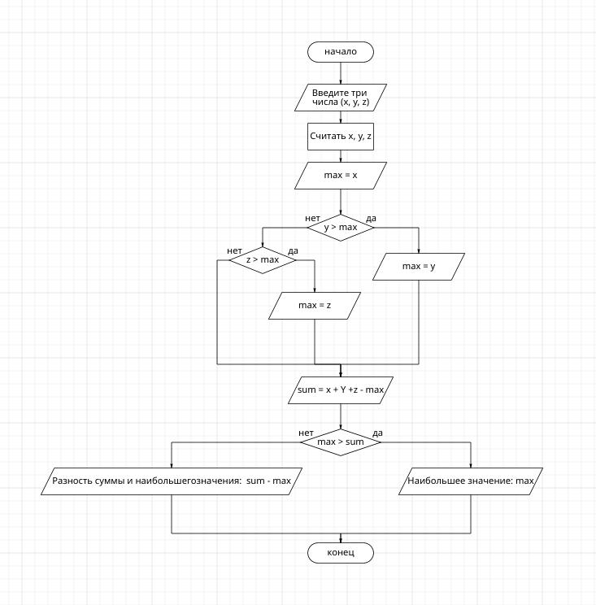

# Отчёт

## Вариант 2
2. Вывести значение наибольшего из трёх параметров x, y, z если оно больше суммы двух других параметров, и разность этой суммы и наибольшего значения иначе.

## Исходный код
```c
#include <stdio.h>

    int main() {
        int x, y, z;

        printf("Введит три числа (x, y, z): ");
        scanf("%d %d %d", &x, &y, &z);
    

    int max = x;

    if (y >max) {
        max = y;
    }
    if (z >max) {
        max = z;
    }

    int sum = x + y + z - max;

    if (max > sum) {
        printf("Наибольшее значение: %dn", max);
    } else {
        printf("Разность суммы и наибольшего значения: %dn", sum - max);
    }

    return 0;
    }
```

## Результат работы программы


## Блок-схема



