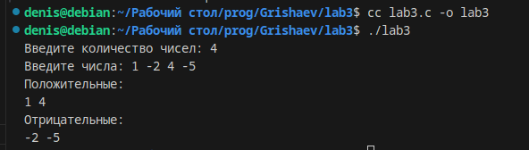

# Отчёт
## Вариант 2

Максимально эффективно по используемой памяти записать отрицательные и положительные элементы массива в массивы P и N соответственно.

## Исходный код
```c
#include <stdio.h>

int main() {
    printf("Введите количество чисел: ");
    int size;
    scanf("%i", &size);

    int A[size];
    printf("Введите числа: ");
    for(int i = 0; i != size; i++)
        scanf("%i", &A[i]);

    int p = 0, n = 0; // количество положительных и отрицательных
    for(int i = 0; i != size; i++) {
        if(A[i] >= 0) p++;
        else n++;
    }

    int P[p], N[n];
    p = 0;
    n = 0;
    for(int i = 0; i != size; i++) {
        if(A[i] >= 0) {
            P[p] = A[i];
            p++;
        } else {
            N[n] = A[i];
            n++;
        }
    }

    printf("Положительные:\n");
    for(int i = 0; i != p; i++)
        printf("%i ", P[i]);
    printf("\n");
    printf("Отрицательные:\n");
    for(int i = 0; i != n; i++)
        printf("%i ", N[i]);
    printf("\n");
}
```

## Результат программы


