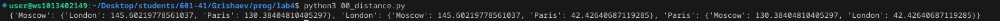
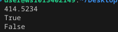
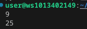
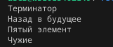
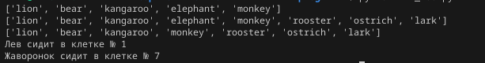
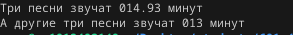
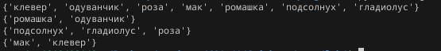
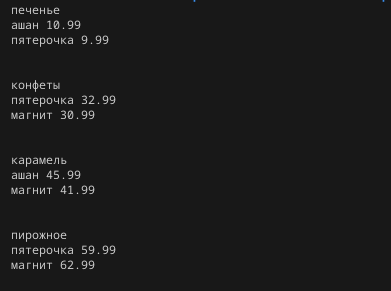
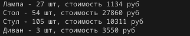

# Отчёт

## Задание 00

Составим словарь словарей расстояний между ними

## Задание 01

Выведите на консоль значение прощади этого круга с точностю до 4-х знаков после запятой

## Задание 02

Расставьте знаки операций "плюс", "минус", "умножение" и скобки
между числами "1 2 3 4 5" так, что бы получилось число "25".

## Задание 03

Выведите на консоль с помощью индексации строки, последовательно:
первый фильм
последний
второй
второй с конца

## Задание 04

Выведите на консоль общий рост вашей семьи как сумму ростов всех членов
Общий рост моей семьи - ХХ см

## Задание 05 

выведите на консоль в какой клетке сидит лев (lion) и жаворонок (lark).

## Задание 06

распечатайте общее время звучания трех песен: 'Sweetest Perfection', 'Policy of Truth' и 'Blue Dress'

## Задание 07

Расшифровать сообщение

## Задание 08

создайте множество цветов, произрастающих в саду и на лугу
 - выведите на консоль все виды цветов
 - выведите на консоль те, которые растут и там и там
 - выведите на консоль те, которые растут в саду, но не растут на лугу
 - выведите на консоль те, которые растут на лугу, но не растут в саду

## Задание 09

Создайте словарь цен на продкты

## Задание 10

Вывести стоимость каждого вида товара на складе и общую цену

