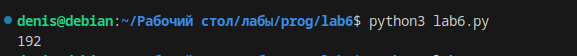
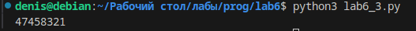

## Отчёт 

#  Вариант 2

# Задание 1

Ольга составляет таблицу кодовых слов для передачи сообщений, каждому сообщению соответствует своё кодовое слово. В качестве кодовых слов Ольга использует 4-буквенные слова, в которых есть только буквы A, B, C, D, X, Y, Z. При этом первая буква кодового слова  — это буква X, Y или Z, а далее в кодовом слове буквы X, Y и Z не встречаются. Сколько различных кодовых слов может использовать Ольга?

# Задание 2

Значение арифметического выражения 9^8+3^5−9 записали в системе счисления с основанием 3. Сколько цифр 2 содержится в этой записи?

# Задание 3 

Найдите все натуральные числа, принадлежащие отрезку [45000000; 50000000], у которых ровно пять различных нечётных делителей (количество чётных делителей может быть любым). Выведите найденные числа в порядке возрастания.

