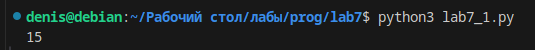
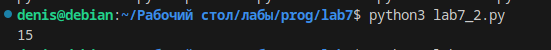
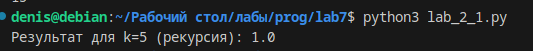
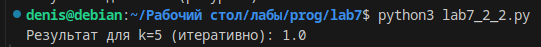

# Отчёт 
## Задача 1

Функция для расчёта суммы вложенных списков.
>>> sum_nested([1, [2, [3, 4, [5]]]])
15

 - С рекурсией

```c
def sum_nested_recursive(nested_list):
    total = 0
    for element in nested_list:
        if isinstance(element, list):
            total += sum_nested_recursive(element)
        else:
            total += element
    return total


result = sum_nested_recursive([1, [2, [3, 4, [5]]]])
print(result)
```

## Результат



 - Без рекурсии

```c
def sum_nested_non_recursive(nested_list):
    total = 0
    stack = [nested_list] 

    while stack:
        current_list = stack.pop()
        for element in current_list:
            if isinstance(element, list):
                stack.append(element)
            else:
                total += element

    return total

result = sum_nested_non_recursive([1, [2, [3, 4, [5]]]])
print(result)
```

## Результат



## Задача 2

Функция для расчёта ak=12(bk−1+12ak−1)ak​=21​(bk−1​+21​ak−1​). a1=b1=1a1​=b1​=1.

 - С рекурсией

```c
import math

def calculate_a_iterative(k):
    a_prev, b_prev = 1, 1  
    for i in range(2, k + 1):
        a_prev = 0.5 * (math.sqrt(b_prev) + math.sqrt(a_prev))
    return a_prev

k = 10
print(f"Результат для k={k} (итеративно): {calculate_a_iterative(k)}")
```

## Результат



 - Без рекурсии

 ```c
 import math

def calculate_a_recursive(k, a_prev=1, b_prev=1):
    if k == 1:
        return a_prev
    b_k_minus_1 = b_prev
    a_k_minus_1 = a_prev
    return 0.5 * (math.sqrt(b_k_minus_1) + math.sqrt(calculate_a_recursive(k - 1, a_k_minus_1, b_k_minus_1)))

k = 32
print(f"Результат для k={k} (рекурсия): {calculate_a_recursive(k)}")
```

## Результат

