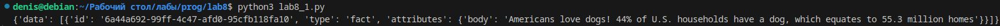
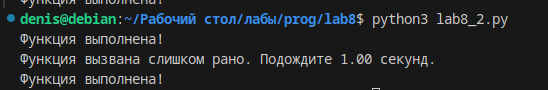

# Отчёт 

## Задание 1

Замыкание для получение текста ответа на запрос к API, например https://dogapi.dog/api/v2/facts.

```c
import requests

def api_decorator(func):
    def wrapper(*args, **kwargs):
        try:
            response = func(*args, **kwargs)
            response.raise_for_status()
            return response.json()  
        except requests.RequestException as e:
            print(f"Произошла ошибка при запросе: {e}")
            return None
    return wrapper

def get_dog_fact_api():
    @api_decorator
    def fetch_dog_fact():
        url = "https://dogapi.dog/api/v2/facts"
        return requests.get(url)
    
    return fetch_dog_fact()

if __name__ == "__main__":
    dog_fact = get_dog_fact_api()
    if dog_fact:
        print(dog_fact)
```

### Результат 



## Задание 2

```c
import time
from functools import wraps

def rate_limiter(interval):
 
    def decorator(func):
        last_called = [0] 
        
        @wraps(func)
        def wrapper(*args, **kwargs):
            current_time = time.time()
            elapsed_time = current_time - last_called[0]
            
            if elapsed_time >= interval:
                last_called[0] = current_time
                return func(*args, **kwargs)
            else:
                print(f"Функция вызвана слишком рано. Подождите {interval - elapsed_time:.2f} секунд.")
        
        return wrapper
    return decorator

@rate_limiter(2) 
def my_function():
    print("Функция выполнена!")


my_function()  
time.sleep(1)
my_function() 
time.sleep(2)
my_function()  
```

### Результат


