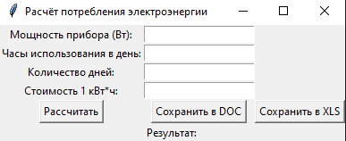
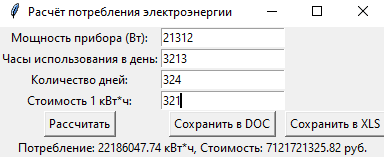
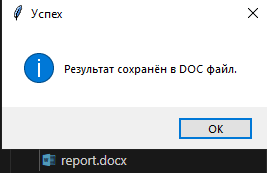
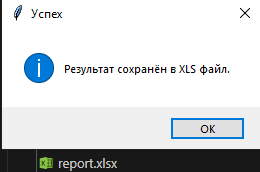

# Отчёт
## Задание
Бытовая техника
- Утюг
- Телевизор
- Стиральная машина

Расчёт потребления электроэнергии и стоимости использования прибора за заданный период.
## Запуск
```
python main.py
```
## Фото работы







