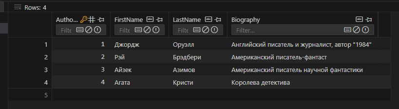
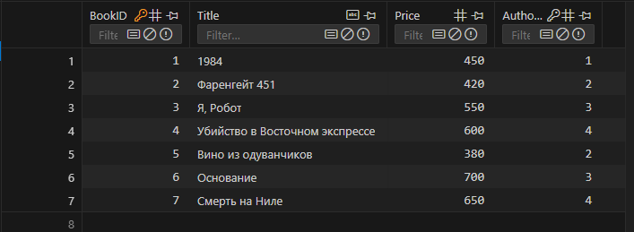
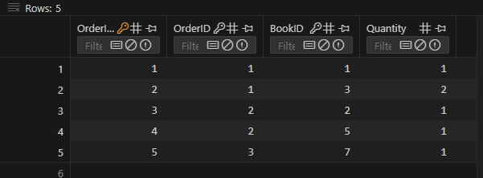
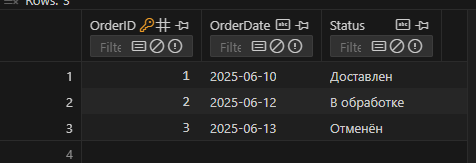
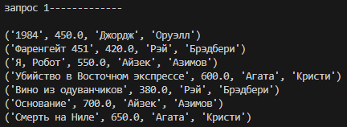
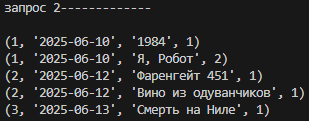
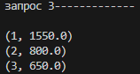

# Отчёт
## Задание
1) Спроектируйте БД с использованием crow’s foot notation.
2) Создайте таблицы БД и заполните данными. Для генерации данных можно использовать сервис https://www.mockaroo.com/.
3) Напишите несколько запросов для выборки данных из всех таблиц.
4) Оформите отчёт в README.md. 
5) Задание

База данных для учета книг в книжном магазине:
- Таблица Книги с информацией о книгах в магазине, такой как название, автор и цена.
- Таблица Авторы с информацией об авторах книг, например, их имена и биографии.
- Таблица Заказы с информацией о заказах книг, такой как дата заказа и статус доставки.
## Запуск
```
python main.py
```
## Запуск запросов
```
python zapr.py
```
## Фото работы программы
### База данных








### Запросы





