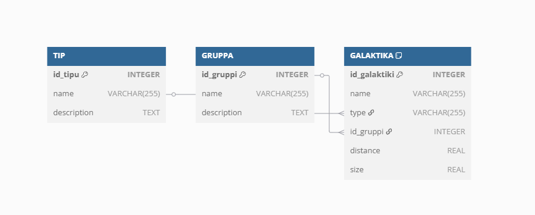
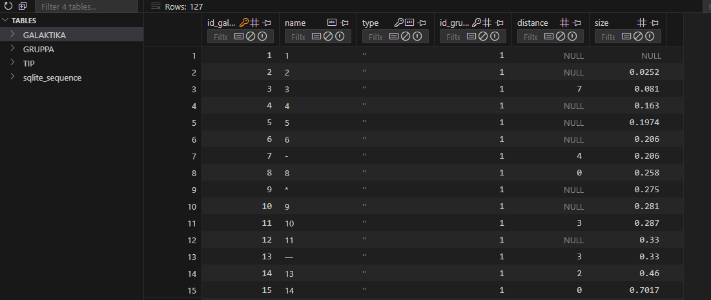
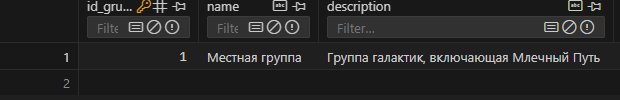
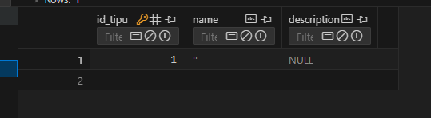
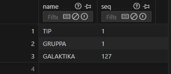
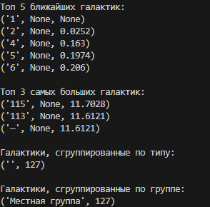

# Отчёт
## Задание 
1) Спроектируйте БД с использованием crow’s foot notation.
2) Реализуйте парсер для сбора данных с веб-страницы.
3) С помощью DB API cоздайте таблицы БД и заполните их данными, полученными с помощью парсера.
4) Напишите запросы для выборки данных из БД.
5) Задание

Список ближайших галактик

Таблицы:
- галактика 
- тип 
- группа

Запросы:
- топ N близких/далёких галактик 
- топ N больших/маленьких галактик 
- галактики с группировкой по типу 
- галактики с группировкой по группе
## Запуск
```
python main.py
```
## crow’s foot notation

## Фото работы программы
(это лучший результат из всех)
### База данных







### Запросы
