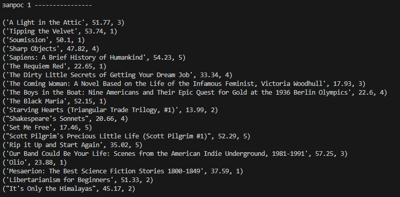

# Отчёт
## Задание 
1) Реализуйте парсер с использованием Selenium для сбора данных с веб-страницы. Это может быть:

онлайн-каталог, интернет-магазин, энциклопедия и т.д.

2) Создайте таблицы БД и заполните их данными, полученными с помощью парсера. У вас должно быть минимум 2 таблицы. При заполнении в запросах используйте именованные плейсхолдеры драйвера вашей СУБД.

3) Напишите запросы для выборки данных из БД с использованием PyPika Query Builder. У вас должно быть:
- 2 запроса с JOIN
- 3 запроса с расчётом статистики/группировкой/агрегирующими функциями
## Запуск
```
python main.py
```
## crow’s foot notation

## Фото работы программы
### База данных


### Запросы



