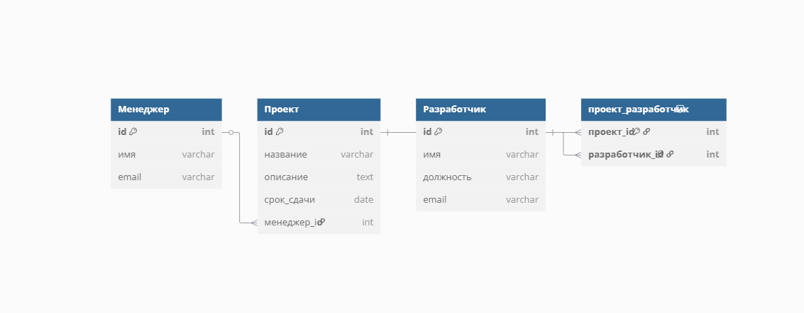
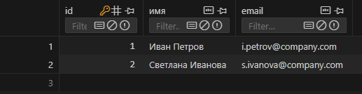
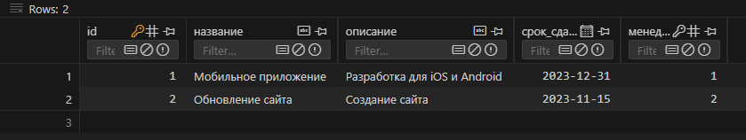
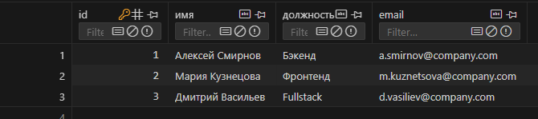
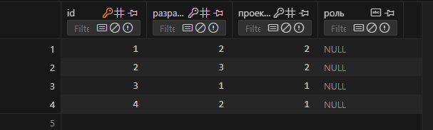
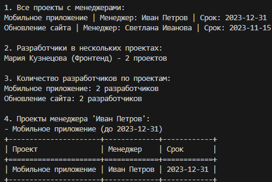

# Отчёт
## Задание 
Разработка ПО. У каждого проекта есть своя команда разработчиков, но единственный менеджер. Разработчики могут участвовать в нескольких проектах одновременно.
## Запуск
```
python main.py
```
## crow’s foot notation


## Фото работы программы
### База данных








### Запросы
